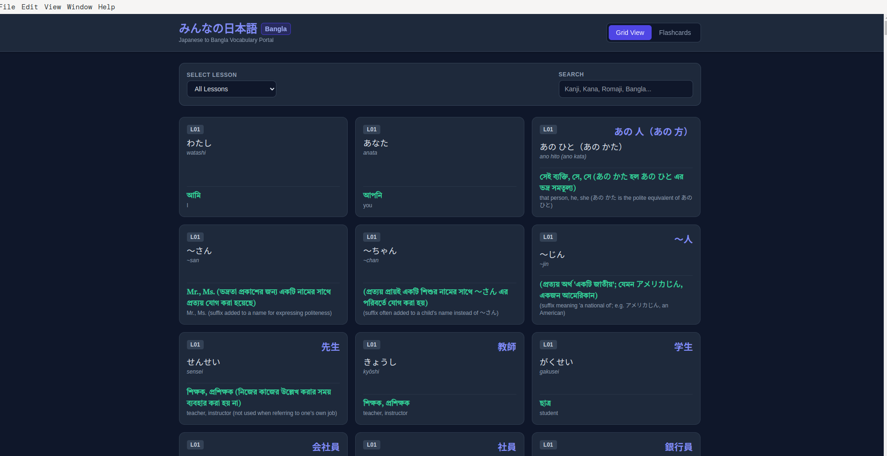
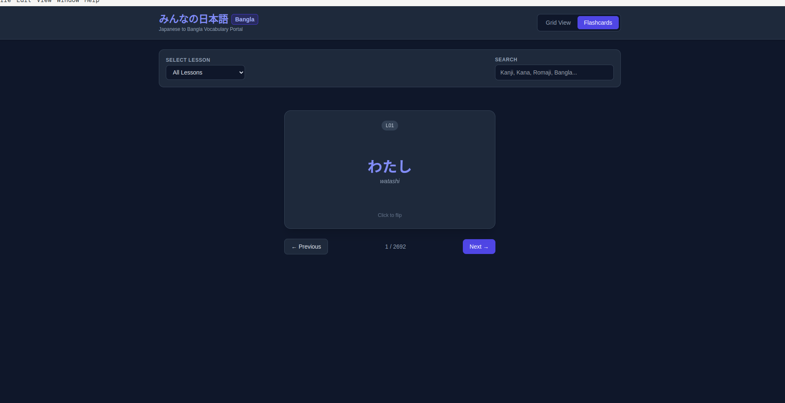

# japnese-bangla-vocab

# 🇯🇵 Japanese Bangla Vocab App

A cross-platform desktop application built with **Electron** and **Electron Forge** designed to help Bengali speakers learn Japanese vocabulary efficiently (focused on *Minna no Nihongo*).

---

## 🌟 Overview

**Japanese Bangla Vocab** is a simple, lightweight, and intuitive desktop app created for students preparing for JLPT N5/N4 exams or anyone learning Japanese through Bengali explanations. It structures words by lessons to make memorization and revision seamless.

---

## ✨ Features

- **📖 Lesson-wise Vocabulary:** Structured vocabulary lists based on the *Minna no Nihongo* curriculum.
- **🇧🇩 Bangla Translation:** Accurate Bengali meanings along with Kanji, Kana (Hiragana/Katakana), and Romaji.
- **⚡ Native Desktop Experience:** Built for Linux (`.deb`) and Windows (`.exe` / Squirrel installer) with minimal system resource usage.
- **🔍 Quick Search & Navigation:** Easily search words and navigate through lessons.
- **🎯 JLPT N5/N4 Focused:** Essential vocabulary needed for beginner-level Japanese proficiency tests.
- ## 📷 Screenshots

<p align="center">
  
  
</p>

---

## 🛠️ Built With

- **Framework:** [Electron](https://www.electronjs.org/)
- **Build Tool:** [Electron Forge](https://www.electronforge.io/)
- **Languages:** JavaScript, HTML5, CSS3

---

## 🚀 Installation & Usage

### Running Locally

1. **Clone the repository:**
   ```bash
   git clone [https://github.com/SHADw9/japnese-bangla-vocab.git](https://github.com/SHADw9/japnese-bangla-vocab.git)
   cd japnese-bangla-vocab
